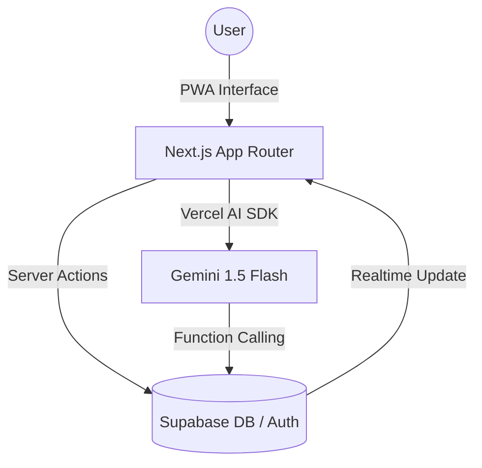

# Strive

**Strive** is a minimalist, AI-first Progressive Web App (PWA) designed to turn personal discipline into an automated lifestyle. Built with a "Cloud-Native" mindset, Strive moves away from the anxiety of rigid daily streaks toward a flexible, momentum-based approach to habit building.

> *Your routines, your pace. Powered by AI.*

---

## The Philosophy

Traditional habit trackers fail because life is unpredictable. Strive is built on three core pillars identified through user discovery:

1. **Flexible Consistency**: Success isn't just "every day"; it's hitting your target. If your goal is 3x/week, Strive celebrates your progress whether you do it on Monday or Sunday.
2. **Zero-Friction Logging**: The hardest part of a habit is tracking it. Strive uses a conversational AI Agent to let you log activities via natural language—just say it, and it's done.
3. **Quiet Luxury UI**: Inspired by Linear and Apple's minimalist aesthetic, the interface stays out of your way, focusing on "Flow" and "Momentum".

### Terminology

- **Rituals**: We don't track "tasks". We build rituals—long-term intentions that define who you are.
- **Momentum**: Our version of streaks. It measures the energy of your consistency over rolling periods (weekly/monthly).
- **Logging**: The act of recording progress. Can be manual (tap) or conversational (AI).
- **Flow**: Your personalized dashboard—a focused state of mind for your daily routine.

---

## Tech Stack (Zero-Cost Architecture)

Designed for high performance and scalability using a $0/month "Hobby Stack".

| Layer | Technology |
|---|---|
| **Frontend** | [Next.js 15](https://nextjs.org/) (App Router, Server Actions) |
| **Database & Auth** | [Supabase](https://supabase.com/) (PostgreSQL + RLS) |
| **AI Engine** | [Vercel AI SDK](https://sdk.vercel.ai/) + Google Gemini 1.5 Flash (Free Tier) |
| **Styling** | [Tailwind CSS](https://tailwindcss.com/), [Shadcn/UI](https://ui.shadcn.com/), Lucide Icons |
| **Mobile** | PWA (Service Workers, Web Push API for iOS 16.4+) |
| **Project Management** | [Linear](https://linear.app/) for sprint planning |

---

## System Architecture

Strive leverages a modern "Backend-as-a-Service" architecture to maintain a lean codebase while ensuring enterprise-grade security and AI integration.

---

## User-Centric Design (User Stories)

Development is guided by the following core user needs:

- As a **busy professional**, I want to log my habits via a quick voice note so that I don't have to open a complex app while on the move.
- As a **fitness enthusiast**, I want to set a "3 times per week" goal so that I don't feel like a failure if I miss a specific day due to work.
- As a **PWA user on iPhone**, I want to receive a push notification on Thursday if I'm behind on my weekly goals so that I can catch up before the weekend.

---

## Roadmap

### Phase 1: Foundation 🟢
- [x] Initial Product Purpose & Branding
- [x] Technical Architecture Design
- [x] Supabase Schema & RLS Policies
- [ ] Next.js 15 Boilerplate with Tailwind & Shadcn

### Phase 2: Core Experience 🔵
- [ ] Ritual CRUD (Daily/Weekly/Monthly logic)
- [ ] Interactive "Flow" Dashboard
- [ ] Dynamic Momentum Algorithm (SQL-based streak calculation)

### Phase 3: Intelligence & Mobile 🟣
- [ ] AI Agent Integration (Natural Language Processing)
- [ ] Tool Calling for automated habit logging
- [ ] PWA Manifest & Web Push Notifications for iOS

### Phase 4: Social (V2) 🟠
- [ ] Private "Momentum Circles" with friends
- [ ] Shared Rituals and progress feed

---

## Developed by

**Luidgi** — Junior Backend & Cloud Developer  
Looking to bridge the gap between robust infrastructure and delightful user experiences.
