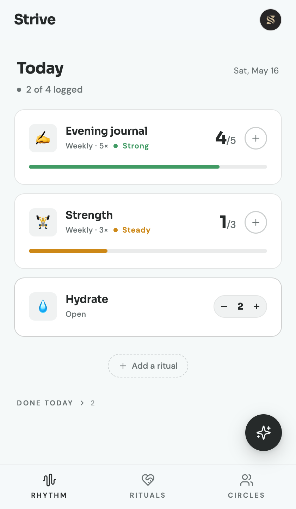
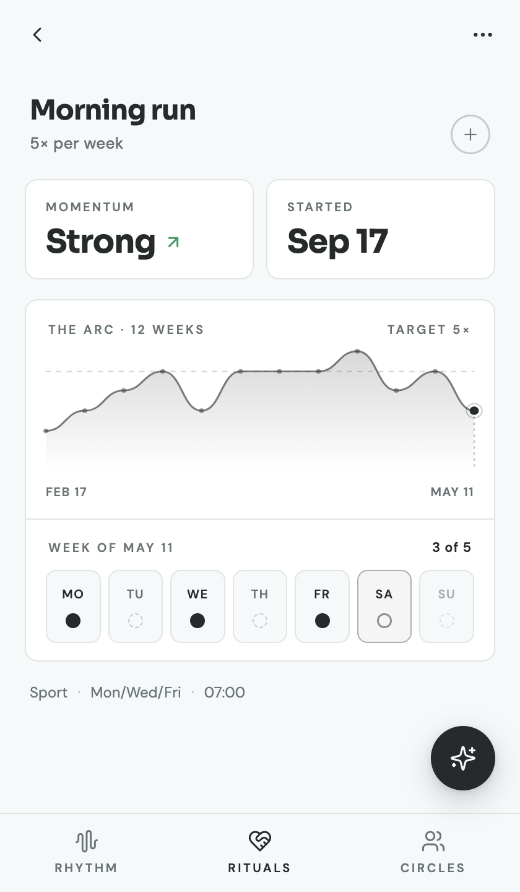
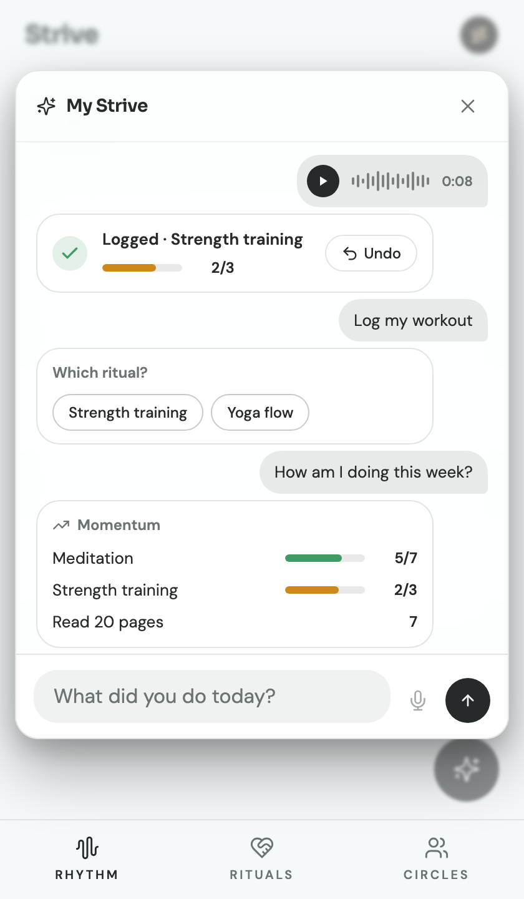

<picture>
  <source media="(prefers-color-scheme: dark)" srcset="public/readme-banner-dark.png">
  
</picture>

# Strive

[](https://github.com/luidgi-dev/strive/actions/workflows/ci.yml)&nbsp;[](LICENSE)

[Live app](https://www.striveapp.cc) &nbsp;·&nbsp; [Technical deep dive](docs/DEEP_DIVE.md) &nbsp;·&nbsp; [Documentation](docs/README.md)

Strive (live at [striveapp.cc](https://www.striveapp.cc)) is a minimalist, AI-first ritual tracker PWA. It replaces the anxiety of daily streaks with a flexible system grounded in weekly and monthly **consistency**: momentum that decays slowly, never resets to zero, and treats rest days as part of the practice.

**Try it without signing up.** The landing page has a *Try the demo* button that opens a populated account, resets nightly. No credentials needed.

**Status:** live, feature complete for the first release. Built solo. Maintained rather than actively expanded.

<p>
  <picture><source media="(prefers-color-scheme: dark)" srcset="public/wireframes/rhythm-dark.png"></picture>&nbsp;&nbsp;&nbsp;&nbsp;&nbsp;
  <picture><source media="(prefers-color-scheme: dark)" srcset="public/wireframes/the-arc-dark.png"></picture>&nbsp;&nbsp;&nbsp;&nbsp;&nbsp;
  <picture><source media="(prefers-color-scheme: dark)" srcset="public/wireframes/ai-chat-v2-dark.png"></picture>
</p>

<sub>Rhythm, today at a glance &nbsp;·&nbsp; The Arc, twelve weeks of consistency &nbsp;·&nbsp; My Strive, logging in plain language</sub>

## What is Strive

- **Flexible consistency** instead of binary success/failure.
- **Zero-friction logging**, including conversational flows powered by AI.
- **Quiet luxury UI**: minimal, fast, clear, dark-by-default.

The full product specification lives in [`docs/PRODUCT_SPEC.md`](docs/PRODUCT_SPEC.md). Canonical terminology and tone are in [`docs/UX_WRITING.md`](docs/UX_WRITING.md).

## Tech stack

- **Next.js 16** (App Router, Server Components by default)
- **TypeScript 5**, React 19
- **Supabase** (PostgreSQL + Auth + RLS) via `@supabase/ssr`
- **next-intl** for routing-aware i18n (`en`, `fr`)
- **Tailwind CSS v4** + shadcn/Base UI primitives
- **next-themes** for light/dark theming
- **Vercel AI SDK** (`ai` + `@ai-sdk/google`) with Google **Gemini** (`gemini-2.5-flash`) for the app's AI features
- **Vitest** for unit tests (pure logic: dates, momentum, scheduling)

## Repository structure

| Path          | Role                                                  | Reference                                      |
| ------------- | ----------------------------------------------------- | ---------------------------------------------- |
| `app/`        | Next.js App Router (locale-aware routes)              | [`app/README.md`](app/README.md)               |
| `components/` | Reusable React components                             | [`components/README.md`](components/README.md) |
| `lib/`        | Supabase clients and shared utilities                 | [`lib/README.md`](lib/README.md)               |
| `messages/`   | i18n translations (`en.json`, `fr.json`)              | n/a                                            |
| `data/`       | DB schema, seeds, triggers, views, migration runner   | [`data/README.md`](data/README.md)             |
| `docs/`       | Architecture, design system, UX writing, product spec | [`docs/README.md`](docs/README.md)             |
| `design/`     | Design workspace (wireframes, mockups, research)      | [`design/README.md`](design/README.md)         |
| `.agents/`    | Reusable AI skill packs                               | [`.agents/README.md`](.agents/README.md)       |
| `.github/`    | CI workflows and AI review prompts                    | [`.github/WORKFLOWS.md`](.github/WORKFLOWS.md) |

Root files like `proxy.ts`, `i18n.ts`, `next.config.ts`, `tsconfig.json` are build/runtime critical and are documented in [`docs/ARCHITECTURE.md`](docs/ARCHITECTURE.md).

## Quick start

Prerequisites: Node.js 24+ (see `.nvmrc`) and npm. Step 3 also needs Python 3 with `psycopg2-binary` and `python-dotenv` (`pip install psycopg2-binary python-dotenv`), since the migration runner is a Python script.

1. Create a `.env.local` at the repo root with:
  ```env
   NEXT_PUBLIC_SUPABASE_URL=...
   NEXT_PUBLIC_SUPABASE_PUBLISHABLE_KEY=...
   DATABASE_URL=postgresql://postgres:<password>@<host>:5432/postgres  # used by the migration runner in step 3
   GOOGLE_GENERATIVE_AI_API_KEY=...   # AI features (Gemini); optional STRIVE_AI_MODEL overrides the model
   SUPABASE_SERVICE_ROLE_KEY=...      # server-only; the Insights cron generates under the service role
   CRON_SECRET=...                    # shared secret authorizing the Insights cron route
   NEXT_PUBLIC_VAPID_PUBLIC_KEY=...   # Web Push: public VAPID key (sent to the browser)
   VAPID_PRIVATE_KEY=...              # Web Push: private VAPID key (server-only, never exposed)
   VAPID_SUBJECT=mailto:you@example.com  # Web Push: VAPID contact (mailto: or https:)
  ```
  Generate the VAPID pair once with `npx web-push generate-vapid-keys`. See
  [`design/push-notifications.md`](design/push-notifications.md) for the notification rules and stack.
2. Install dependencies:
  ```bash
   npm install
  ```
3. Set up the database. The app reads from Supabase on first load, so a fresh, empty project will error out. Apply the schema, functions, triggers, and seeds with the migration runner. Full steps, prerequisites and `DATABASE_URL` details are in [`data/README.md`](data/README.md):
  ```bash
   python data/migrate.py
  ```
4. Run the dev server:
  ```bash
   npm run dev
  ```
5. Open [http://localhost:3000](http://localhost:3000).

Run `npm test` to execute the unit suite, `npm run lint` to lint, and `npm run build` for a production build.

For database setup (migrations, seeds, RLS), see [`data/README.md`](data/README.md). For Supabase client usage, see [`lib/README.md`](lib/README.md).

> **Testing PWA features locally.** Service workers and Web Push do not behave reliably over `http://localhost:3000`. Run a production build (`npm run build && npm run start`) or expose the dev server through an HTTPS tunnel (e.g. `ngrok`, `localtunnel`) to exercise the install prompt and notifications.

## Internationalization

Strive ships in **English** and **French**, served via `next-intl` and locale-prefixed routes (`/en/...`, `/fr/...`). All user-facing strings live in [`messages/en.json`](messages/en.json) and [`messages/fr.json`](messages/fr.json), never hardcoded in components. Locale is resolved by [`i18n.ts`](i18n.ts) and the runtime middleware in [`proxy.ts`](proxy.ts).

## Theming

Light and dark modes via `next-themes`. Color tokens are defined as CSS custom properties in [`app/globals.css`](app/globals.css) and the canonical visual contract is in [`docs/DESIGN_SYSTEM.md`](docs/DESIGN_SYSTEM.md). Never hardcode hex/rgb values. Always reference Tailwind tokens.

## CI & automation

Two GitHub Actions workflows guard the repo:

- `pr-review.yml`: AI-assisted review on every pull request, checking code semantics, terminology, and architectural fit.
- `project-audit.yml`: periodic project-wide audit for documentation drift and architectural health.

Both workflows consume prompts from `.github/prompts/`. See [`.github/WORKFLOWS.md`](.github/WORKFLOWS.md) for the full setup.

## Testing

Unit tests run on **Vitest** and are **co-located** with the code they cover (`*.test.ts`), focused on the pure, high-value logic that drives the app: date math, momentum derivation, and the Rhythm "what shows today" selection.

```bash
npm test            # run the suite once
npm run test:watch  # watch mode during development
```

Coverage is intentionally scoped to pure logic for now; component and end-to-end tests are planned and would live under a top-level `tests/` folder. See [`lib/README.md`](lib/README.md) for the current test map.

## AI agent guidelines

This repo is designed to be coded with AI agents. Three files keep agents aligned:

- [`AGENTS.md`](AGENTS.md): single source of truth for agent rules (terminology, code semantics, protocol).
- [`CLAUDE.md`](CLAUDE.md): Claude Code entry index.
- [`.cursor/rules/strive.mdc`](.cursor/rules/strive.mdc): Cursor-specific workflow on top of `AGENTS.md`.

Reusable skill packs (e.g. Supabase Postgres best practices) live under [`.agents/skills/`](.agents/).

## Documentation

The full documentation index is [`docs/README.md`](docs/README.md). Highlights:

- [`docs/DEEP_DIVE.md`](docs/DEEP_DIVE.md): why the architecture is what it is, schema rationale, RLS model, AI design, trade-offs at scale
- [`docs/BUILD_LOG.md`](docs/BUILD_LOG.md): how it was built, the decisions behind the decisions, what I would do differently
- [`docs/PITCH.md`](docs/PITCH.md): the product story, from one-liner to a three-minute pitch
- [`docs/ARCHITECTURE.md`](docs/ARCHITECTURE.md): architecture and file structure
- [`docs/DESIGN_SYSTEM.md`](docs/DESIGN_SYSTEM.md): design tokens
- [`docs/UX_WRITING.md`](docs/UX_WRITING.md): canonical terminology and tone
- [`docs/OBSERVABILITY.md`](docs/OBSERVABILITY.md): error monitoring and performance (Sentry)

## Contributing

See [`.github/CONTRIBUTING.md`](.github/CONTRIBUTING.md). In short: branch off `dev`, PRs target `dev`, keep TypeScript strict, and use design tokens + Strive terminology. Please also follow the [Code of Conduct](.github/CODE_OF_CONDUCT.md); report vulnerabilities per the [Security Policy](.github/SECURITY.md).

## Links

- **Live app:** [striveapp.cc](https://www.striveapp.cc)
- **Instagram:** [@striveapp.cc](https://www.instagram.com/striveapp.cc/)

## License

[PolyForm Noncommercial 1.0.0](LICENSE). © 2026 Luidgi. The source is available to read and learn from; commercial use is not permitted.