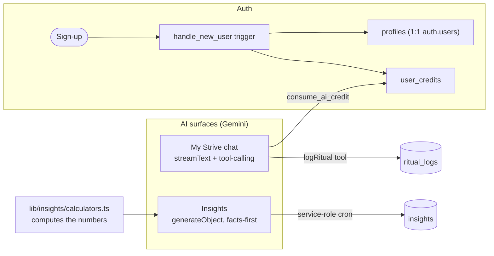

# Strive: Technical Deep Dive

> Engineering companion to [`PITCH.md`](PITCH.md). Audience: developers,
> reviewers, and technical interviewers. It explains not just *what* Strive is
> built on, but *why* each decision was made and what would change at scale.

For the file-by-file map see [`ARCHITECTURE.md`](ARCHITECTURE.md); for the
database layout see [`../data/README.md`](../data/README.md). This doc focuses on
the reasoning behind those structures and is intentionally not a duplicate of
them.

**Status:** v1.0 (2026-06-28)

---

## 1. System at a glance

Strive is a single Next.js 16 app (App Router, root-level, no separate `web/`
package) backed by Supabase Postgres, internationalized with `next-intl`, and
shipped as an installable PWA.

The product's value lives in two places: a calm **AI companion** (frictionless
logging plus personal Insights, so you focus on progressing at your own rhythm)
and a **quiet-luxury experience** (the Rhythm quick-glance of the day, clean
cards, Circles for gentle support). The architecture below exists to serve those
two things, not the other way around.

| Layer | Choice | One-line rationale |
|---|---|---|
| Frontend / SSR | Next.js 16, React 19, Server Components by default | Data fetching stays on the server, close to the database, so the daily surface feels instant. |
| Styling | Tailwind v4 + shadcn / Base UI, `next-themes` | Token-driven, dark-by-default "quiet luxury" UI with no hardcoded colors. |
| Backend | Supabase (Postgres + Auth + RLS) | One platform for data, identity, and per-user isolation enforced in the database. |
| AI | Vercel AI SDK (`ai` + `@ai-sdk/google`), Gemini `gemini-2.5-flash` | A friction-removing feature layered on top, never a hard dependency. |
| i18n | `next-intl`, locale-prefixed routes (`en`, `fr`) | All copy lives in `messages/*.json`, never in components. |
| Tests | Vitest on pure logic (dates, momentum, scheduling) | Coverage where correctness is subtle, not where it is ceremonial. |

### 1.1 Request and data flow

```mermaid
flowchart TD
  User([User / PWA])
  Proxy["proxy.ts (Next.js Proxy)<br/>session refresh + auth gating"]
  RSC["Server Components<br/>lib/supabase/server.ts"]
  CC["Client Components<br/>lib/supabase/client.ts"]
  DB[("Supabase Postgres<br/>RLS per user")]
  Views["Views & functions<br/>ritual_progress, momentum"]

  User -->|request under /[locale]/| Proxy
  Proxy -->|authed| RSC
  Proxy -->|public| RSC
  RSC -->|user session| DB
  CC -->|interactivity only| DB
  DB --> Views
  Views --> RSC
```

Every request under `app/[locale]/` passes through `proxy.ts`, which refreshes
the Supabase session cookie and gates protected routes. Pages never re-implement
auth checks. Server Components are the default reader; a Client Component only
appears when interactivity genuinely requires it.

### 1.2 Auth and AI layers



---

## 2. Schema design rationale

The schema is small on purpose. The interesting decision is what is *not* there.

### 2.1 Core entities

- **`rituals`** is the core entity: a behavior the user wants to repeat. It
  carries a weekly **target** and a type (`recurring`, `one_time`, `open`).
- **`ritual_logs`** holds one row per logged occurrence, stamped `logged_at`,
  with a status drawn from the `log_statuses` reference table (`completed`,
  `rest`, `missed`, `partial`). Multiple logs per day are allowed.
- **`profiles`** extends `auth.users` 1:1 and is created automatically on
  sign-up by the `handle_new_user` trigger, alongside a `user_credits` row.

`ritual_logs` is the single source of truth. Everything else is derived from it.

### 2.2 Momentum is computed, never stored

A load-bearing technical decision that maps directly to the product philosophy.
**Momentum** has no table and no column. It is derived on the fly from
`ritual_logs` through Postgres views and functions:

- `ritual_progress` gives current-period progression and completion rate per
  active ritual.
- `daily_summary` gives the daily snapshot (total, logged today, remaining).
- `ritual_log_history` powers **The Arc**, the 12-week consistency view.

All three views are declared `security_invoker = on`, so they read under the
caller's RLS rather than the view owner's.

Why derive instead of store:

1. **No drift.** A stored counter can disagree with the underlying logs after a
   retroactive edit, a delete, or a timezone bug. A view cannot: it is the logs.
2. **Cheap edits.** Logging, un-logging, and back-dating are plain inserts and
   deletes. There is no counter to reconcile and no migration to recompute.
3. **Honest semantics.** "Momentum decays slowly and never resets to zero" is
   expressible as a query over recent history. As a mutable integer it would be
   a pile of edge cases.

The trade-off is that read queries do more work than reading a cached integer.
At Strive's data volumes (per-user, sparse logs) this is comfortably within the
`< 300ms` Rhythm budget; §5 covers what changes if that stops being true.

All derived data follows the same rule: timestamps are `timestamptz`
everywhere, ids are `uuid` with `gen_random_uuid()`, and SQL is lowercase. See
[`../data/README.md`](../data/README.md) for the full conventions.

---

## 3. RLS and the security model

Row Level Security is enabled on **every** table that carries a `user_id`. A
user can only ever read or write their own rows, and that boundary lives in the
database, not in application code, so no forgotten check in a route can leak
data.

### 3.1 The default case

Tables like `rituals` and `ritual_logs` are owner-only: the policy compares
`auth.uid()` to the row's `user_id`. Reference tables (`log_statuses`,
`tier_quotas`, `ritual_categories` with `user_id = null`) are read-only for
clients. Global config (`system_settings`, holding the AI kill-switch) is
read-only for clients and flipped only through SQL or the service role.

### 3.2 The hard case: Circles (Phase 4)

Social features need cross-user reads without leaking private data, which is
where RLS gets subtle. The whole boundary is enforced in the database:

- **`is_circle_member()` is a `security definer` helper.** A membership policy
  needs to ask "is the caller a member of this circle?", but querying
  `circle_members` from inside its own policy raises infinite recursion. The
  helper runs as its owner for that one scoped lookup, so every policy stays
  flat. It is applied before the tables that reference it.
- **Joins are not self-serve.** Only a circle owner can self-insert (the create
  flow). Everyone else joins through `redeem_circle_invite()`, a `security
  definer` function that validates expiry, cap, `max_uses`, and
  already-member before inserting. A user cannot self-insert into an arbitrary
  circle by hitting the table.
- **The 8-member cap is a trigger** (`enforce_circle_member_limit`), not app
  logic, so no client can exceed it.
- **Invites are never world-readable.** The public `/i/[code]` preview reads
  through a `security definer` function, so the anon role cannot enumerate
  `circle_invites`.
- **Sharing is opt-in.** A ritual appears to a circle only if its owner added a
  `circle_rituals` row, and the insert policy verifies the ritual is theirs.
  Private rituals never surface. Collective reads (`get_circles_momentum`,
  `get_circle_shared_rituals`, `get_circle_feed`) go through scoped security
  definer functions that return aggregates ("X of Y on track") or shared
  metadata only, never another member's raw logs.
- **Leaving is clean.** An `after delete` trigger removes a departed member's
  shared rituals and nudges in that circle, so their progress stops being
  visible the moment they leave.

The policies and the cap are checked by `data/tests/circles_rls.sql`, which runs
inside a transaction and rolls back, touching nothing.

---

## 4. AI integration design

AI is a feature layered on top of a fully usable app, not its foundation. There
are two surfaces, both calling Gemini `gemini-2.5-flash` through one model
helper (`lib/ai/client.ts`), and they are deliberately different shapes.

### 4.1 My Strive chat: conversational, tool-calling

- Route: `app/[locale]/api/chat/route.ts`; logic in `lib/ai/`.
- Uses the Vercel AI SDK `streamText` for a streaming response, with
  **tool-calling** so a message like *"ran 5km today"* becomes a real
  `ritual_logs` insert rather than a chat reply about running.
- Each message reserves one AI credit up front through the `consume_ai_credit`
  RPC (a race-safe check-and-decrement), with `refund_ai_credit` to return it if
  the call fails, so a failed generation never costs the user. Quotas come from
  `tier_quotas` and reset monthly via a `pg_cron` job. The whole AI surface also
  respects a global kill-switch (`system_settings.ai_enabled`, read through
  `isAiEnabled`).

### 4.2 Insights: non-conversational, facts-first

- Route: `app/[locale]/api/cron/insights/route.ts`, run on a schedule under the
  **service role**.
- The backend computes the numbers in `lib/insights/calculators.ts`. The model
  is then handed those facts and only *phrases* them, via `generateObject` with
  a structured `{ headline, body }` schema. **It never invents a number.**
- Results are cached in the `insights` table (`cadence` + `period_start` form
  the per-report identity). Premium-gated and tier-covered, so generating an
  Insight consumes no per-message credit, but it still respects the global
  `ai_enabled` kill-switch.

### 4.3 The pattern

The rule for any new AI entry point: reuse the shared model helper, gate it
through `lib/ai/`, and prefer `generateObject` for anything the app parses. Free
text is for conversation; structured output is for data. The split keeps AI
features both on-brand (see [`UX_WRITING.md`](UX_WRITING.md)) and trustworthy:
the model phrases, the database decides.

---

## 5. Known trade-offs and what would change at scale

Honest about the seams, and what the next version looks like.

| Area | Today (deliberate) | At scale |
|---|---|---|
| **Momentum as views** | Recomputed per read; simple and drift-free at per-user volume. | Add materialized views or a refreshed cache table if read latency approaches the Rhythm budget; logs stay the source of truth. |
| **Security-definer functions** | Powerful and correct, but they bypass RLS by design, so each is a small audit surface. | Keep them few, narrowly scoped, and covered by the rolled-back RLS test; add coverage as Circles grows. |
| **AI credits** | Reserve-then-refund guards against paying for failures. | Move credit accounting fully into a single SQL transaction with the log write if partial-failure races ever appear. |
| **Insights generation** | Scheduled cron under the service role, cached. | Queue per-user generation and add backpressure if the user base outgrows a single scheduled pass. |
| **Testing** | Vitest on pure logic (dates, momentum, scheduling) where bugs hide. | Add component and end-to-end tests under a top-level `tests/` folder; the structure is reserved for it. |
| **PWA / offline** | Installable, fast, dark-by-default. | Harden offline logging with background sync so a log made without a connection reconciles cleanly. |

The throughline: keep correctness in the database, keep the client thin, and let
AI remove friction without ever becoming a single point of failure. That is the
same bet at every layer that the product makes at the surface, consistency over
intensity.

---

## Links

- **Pitch kit:** [`PITCH.md`](PITCH.md)
- **Architecture map:** [`ARCHITECTURE.md`](ARCHITECTURE.md)
- **Database guide:** [`../data/README.md`](../data/README.md)
- **Product spec:** [`PRODUCT_SPEC.md`](PRODUCT_SPEC.md)
- **Voice & terminology:** [`UX_WRITING.md`](UX_WRITING.md)
