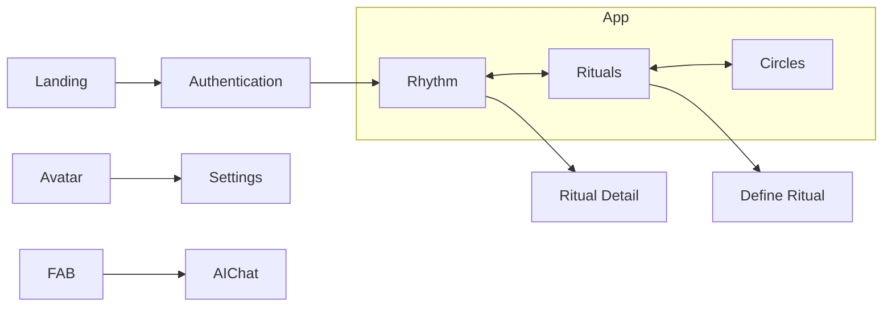

# Product Specification — Strive

AI Ritual Tracking App
Version: v0.1

> Terminology in this document is canonical and follows [`UX_WRITING.md`](UX_WRITING.md). When the spec and `UX_WRITING.md` disagree, `UX_WRITING.md` wins.

---

## 1. Product Overview

Strive is an AI-first ritual tracker focused on **flexible consistency** rather than rigid habit streaks.

The product acts as a **calm coach**, encouraging progress without punishing absence.

### Core Philosophy

- Momentum matters more than streaks
- Missing a day does not reset progress
- Reflection should feel effortless
- AI simplifies logging and reflection

---

## 2. Core Concepts

| Concept | Definition |
|---|---|
| Ritual | A personal behavior the user wants to repeat regularly |
| Target | Weekly desired frequency of a ritual |
| Momentum | Soft progress indicator replacing streaks |
| The Arc | 12-week visualization of ritual consistency |
| Rest | A day without logging activity |

See [`UX_WRITING.md`](UX_WRITING.md) §2 for the full canonical terminology reference.

---

## 3. User Journey

### 3.1 First Time User

```
Landing
↓
Authentication
↓
Create first ritual
↓
Rhythm
↓
Log first action
```

User objective:
- understand concept quickly
- create ritual in <30 seconds
- log first action immediately

### 3.2 Daily Usage

```
Open app
↓
See today's rituals
↓
Log progress
↓
Review momentum
```

Typical session length: 30–60 seconds.

### 3.3 Weekly Reflection

```
Open ritual
↓
View The Arc
↓
Reflect on consistency
↓
Adjust target if needed
```

---

## 4. Navigation Architecture

Primary navigation uses **bottom tabs**.

```
Rhythm | Rituals | Circles
```

Global entry points:

```
Avatar → Settings
FAB → AI Chat
```

---

## 5. Screen Inventory

### 5.1 Landing Page

Purpose: communicate the philosophy.

Elements:
- Logo
- Headline
- Short description (or nothing)
- CTA
- Minimal illustration (TBD)

Example copy:
> Find your rhythm.

CTA: `Get started`

### 5.2 Authentication

Options:
- User name / Email / Password

Minimal UI. No additional onboarding screens (besides email confirmation).

### 5.3 Rhythm (main dashboard)

Main screen of the app.

**Content** — list of rituals scheduled for today. Each ritual card displays:
- ritual name
- weekly target
- momentum state
- quick log action

**Interaction** — tap ritual → Ritual Detail.

### 5.4 Rituals (Library)

Full list of user rituals.

Features:
- add ritual
- edit ritual
- archive ritual (TBD)

Primary action: `Define a ritual`.

### 5.5 Circles (Social)

Optional inspiration space.

Content:
- shared rituals
- reflections
- encouragement

Initial version can be minimal.

### 5.6 Ritual Detail

Detailed view of a ritual.

**Header**
- ritual name & description
- weekly target
- quick log button

**The Arc**
- 12-week consistency visualization
- shows: consistency, rest days, progress trend

**History**
- list of logs

### 5.7 Define Ritual

Bottom sheet modal.

Inputs:

| Field | Type |
|---|---|
| Ritual name | Text |
| Weekly target | Stepper |
| Frequency | Optional |

CTA: `Create ritual`.

### 5.8 Settings

Slide-in panel.

Options:

| Setting | Type |
|---|---|
| Language | EN / FR |
| Theme | Light / Dark |
| Smart reminders | Toggle |

### 5.9 AI Chat

Overlay interface. Used for natural language logging.

Examples:
```
I ran 5km today
Meditated for 10 minutes
Read for half an hour
```

AI parses message and logs ritual activity.

---

## 6. Navigation Flow



---

## 7. UX Writing Principles

Tone: calm, encouraging, reflective, never judgmental.

Vocabulary, forbidden terms, copy examples and code naming all live in [`UX_WRITING.md`](UX_WRITING.md). Do not duplicate them here.

---

## 8. Interaction Rules

### Ritual Logging

Logging must be:
- fast
- frictionless
- reversible

### Momentum

Momentum should:
- increase with activity
- decay slowly
- never reset to zero instantly

---

## 9. Technical Constraints

### Platform

PWA. Must support:
- install to home screen
- offline mode
- background sync

### Performance

Rhythm screen must load in `< 300ms`.

### UI Animations

- Settings panel: `translateX`
- Bottom sheets: `translateY`

---

## 10. Future UX Opportunities

### AI Reflection

Weekly insights generated by AI.

Example:
> Your reading ritual is becoming consistent on weekends.

### Smart Reminders

Adaptive reminders based on user patterns.

### Ritual Bundles

Example: a `Morning ritual` containing meditate, journal, stretch.
